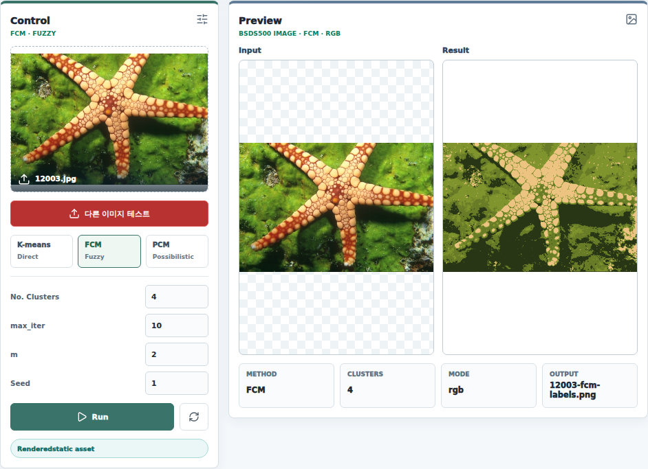

# BSDS500 Image Clustering Workbench

BSDS500 자연 이미지를 대상으로 K-means, Fuzzy C-Means(FCM), Possibilistic C-Means(PCM) 군집화 결과를 비교하는 포트폴리오 프로젝트입니다. FastAPI 기반 clustering API와 React 웹 데모를 연결해, 서버 데이터셋을 선택하고 같은 화면에서 hard clustering, fuzzy clustering, possibilistic clustering의 label map을 즉시 비교할 수 있게 구성했습니다.

이 프로젝트는 세라믹 결함 검출 프로젝트의 clustering 실험을 별도 모듈로 분리한 것입니다. 결함 영상처럼 명암 경계가 애매한 이미지뿐 아니라 BSDS500 샘플처럼 색상과 질감이 다양한 자연 이미지에서도 cluster center, label order, segmentation map이 어떻게 달라지는지 확인할 수 있습니다.

## Problem & Approach

이미지 clustering은 단순히 픽셀을 색상별로 나누는 작업처럼 보이지만, 실제 입력 영상은 조명, 질감, 배경 노이즈, 채널 차이에 따라 결과가 크게 달라집니다. 특히 K-means는 빠르고 직관적인 대신 hard assignment만 제공하고, FCM은 fuzzy membership으로 경계 픽셀의 불확실성을 더 잘 반영하지만 계산량이 늘어납니다. PCM은 membership 합이 1이어야 한다는 제약을 완화해 outlier나 비정형 cluster에 더 유연하게 반응할 수 있습니다.

이 프로젝트의 목표는 세 알고리즘을 같은 입력, 같은 파라미터 UI, 같은 출력 형식으로 맞춰 비교하는 것입니다. API는 입력 이미지를 RGB 또는 grayscale feature space로 변환하고, 각 알고리즘의 label 결과를 `uint8` base64 map으로 반환합니다. 프론트엔드는 이 label map을 canvas에서 다시 색상화해 원본과 결과를 나란히 보여줍니다.

## Web Demo



웹 데모는 서버에 mount된 BSDS500 이미지 목록을 불러온 뒤, 사용자가 선택한 이미지를 API에 전달해 clustering 결과를 생성합니다. 기본 화면에서는 `12003.jpg` 샘플을 FCM으로 처리한 결과를 정적 asset으로 먼저 보여주고, `다른 이미지 테스트`를 통해 서버 이미지 picker와 실시간 API 실행 흐름으로 전환합니다.

컨트롤 패널에서는 method, cluster count, 반복 횟수, fuzziness, seed를 조정할 수 있습니다. 결과 영역은 입력 preview와 label map rendering 결과를 함께 배치해 알고리즘별 분할 양상을 바로 비교할 수 있게 했습니다.

## Method Comparison

| Method | Assignment | Main Parameters | Role |
| --- | --- | --- | --- |
| `kmeans` | Hard label | `clusterCount`, `maxIter`, `attempts`, `seed` | 빠른 기준선 clustering과 centroid 비교 |
| `fcm` | Fuzzy membership | `clusterCount`, `maxIter`, `fuzziness`, `seed` | 경계 픽셀의 불확실성을 반영한 부드러운 분할 |
| `pcm` | Possibilistic typicality | `clusterCount`, `maxIter`, `fuzziness`, `seed` | membership sum 제약을 완화한 noise/outlier 대응 |

K-means는 k-means++ 방식의 초기 중심 선택과 multiple attempts를 사용해 local minimum 영향을 줄였습니다. FCM은 membership matrix를 반복 갱신하며 중심을 계산하고, PCM은 FCM 결과로 초기 중심과 cluster scale을 만든 뒤 typicality를 갱신합니다. PCM 결과가 하나의 cluster로 붕괴하는 경우에는 FCM label을 fallback으로 사용해 데모 화면이 의미 있는 분할 결과를 유지하도록 했습니다.

## API Design

API는 Python FastAPI, OpenCV, NumPy 기반으로 구현했습니다.

| Endpoint | Method | Purpose |
| --- | --- | --- |
| `/api/clustering/files` | `GET` | 서버 `data` 폴더의 이미지 목록 반환 |
| `/api/clustering/image?relativePath=...` | `GET` | 선택한 서버 이미지 preview 반환 |
| `/api/clustering/kmeans` | `POST` | multipart 이미지 업로드 후 K-means clustering 실행 |
| `/api/clustering/fcm` | `POST` | multipart 이미지 업로드 후 FCM clustering 실행 |
| `/api/clustering/pcm` | `POST` | multipart 이미지 업로드 후 PCM clustering 실행 |
| `/api/clustering/{method}/server-file?relativePath=...` | `POST` | 서버 데이터셋 파일을 읽어 선택한 method로 clustering 실행 |

Input은 `PNG`, `JPG`, `JPEG`, `WEBP`, `TIF`, `TIFF`, `BMP` 이미지를 지원합니다. `server-file` API는 `/app/data`로 mount된 데이터셋 내부의 상대 경로만 허용하며, absolute path와 `..` segment를 차단해 path traversal을 방지합니다.

Output은 JSON payload입니다. label image를 PNG blob으로 직접 반환하지 않고, 각 픽셀의 cluster id를 담은 compact label map을 넘겨 프론트에서 팔레트와 overlay 방식을 자유롭게 바꿀 수 있게 했습니다.

```json
{
  "method": "fcm",
  "width": 321,
  "height": 481,
  "colorMode": "rgb",
  "channelCount": 3,
  "clusterCount": 4,
  "parameters": {
    "maxIter": 10,
    "fuzziness": 2.0,
    "seed": 1
  },
  "centers": [[...]],
  "labelOrder": [0, 2, 1, 3],
  "labelMap": {
    "dtype": "uint8",
    "encoding": "base64",
    "shape": [481, 321],
    "data": "..."
  }
}
```


## What I Wanted To Show

이 프로젝트에서 보여주고 싶었던 핵심은 clustering 알고리즘 자체보다, 같은 알고리즘 실험을 재현 가능한 API와 조작 가능한 웹 UI로 연결하는 과정입니다. 서버 데이터셋 탐색, 파라미터 검증, label map 전송, canvas rendering까지 하나의 흐름으로 묶어두면 연구용 이미지 처리 코드를 포트폴리오 서비스 형태로 확장하기 쉬워집니다.
